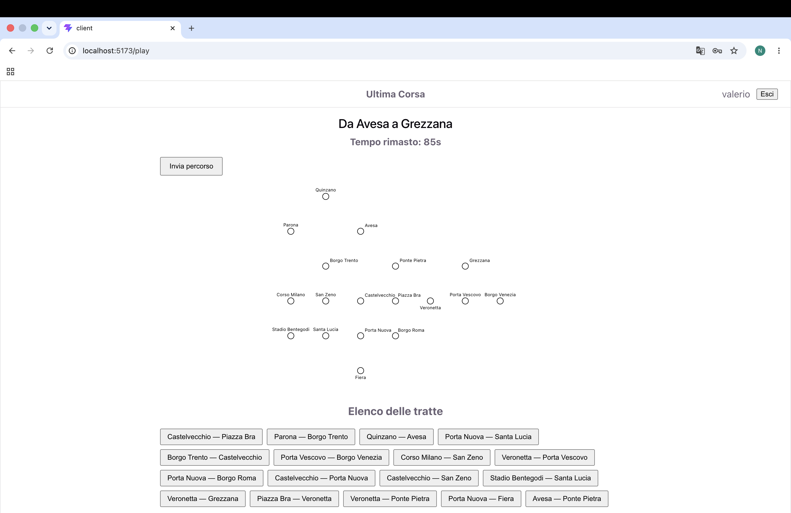
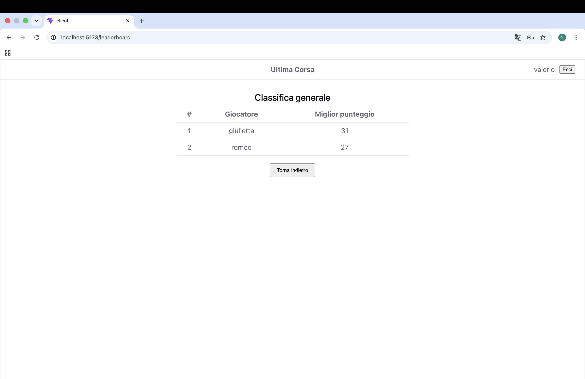

# Ultima Corsa


Applicazione web full-stack (React + Express + SQLite) sviluppata come progetto d'esame per il corso di **Applicazioni Web I** del Politecnico di Torino, e pubblicata qui come progetto di portfolio.

**Ultima Corsa** è un gioco a turno singolo ambientato sulla rete della metropolitana fittizia di Verona: il giocatore osserva la mappa completa, poi deve **ricostruire a memoria** il percorso tra due stazioni assegnate dal server, entro 90 secondi e senza più vedere le linee colorate. Se il percorso è corretto, il viaggio parte e ogni tratta può portare un imprevisto che fa guadagnare o perdere monete; il totale finale entra nella classifica generale.





## Scopo della repo

La repo mostra un'applicazione web completa realizzata da zero, con particolare attenzione a:

- **Separazione client/server**: il client non riceve mai le informazioni che renderebbero banale il gioco. In fase di Pianificazione l'API restituisce solo stazioni e tratte, senza le linee di appartenenza; la validazione del percorso, l'estrazione degli eventi e il calcolo del punteggio avvengono esclusivamente sul server.
- **Modello dei dati minimale**: la rete è memorizzata come sequenza ordinata stazione-linea (`line_stations`). Adiacenze, tratte e stazioni di interscambio non sono salvate, ma **derivate** a runtime dal grafo (`server/graph.js`).
- **Logica di gioco lato server**: validazione del percorso con regole non banali — cambio linea consentito solo negli interscambi, ogni tratta utilizzabile una sola volta — e assegnazione di partenza/arrivo garantita a distanza minima di 3 tratte tramite BFS.
- **Autenticazione e sessioni**: login con Passport (strategia locale), password salvate con `scrypt` e sale per-utente, sessione via cookie e route protette sia lato server sia lato client.
- **Gestione dello stato in React**: l'intera partita è una macchina a stati interna a un'unica route (`/play`), senza cambi di URL tra le fasi.
- **Mappa SVG disegnata a mano**, riutilizzata in due modalità (con e senza linee) dalle fasi di Osservazione e Pianificazione.

## Stack tecnologico

| Ambito | Tecnologie |
| --- | --- |
| Client | React 19, React Router 7, Vite, CSS scritto a mano (nessun framework UI) |
| Server | Node.js, Express 5, Passport + passport-local, express-session |
| Database | SQLite (`better-sqlite3`) |

## Avvio in locale

Requisiti: Node.js 20+ (richiesto da Vite 8).

```bash
# Server (http://localhost:3001)
cd server
npm install
node index.js

# Client (http://localhost:5173), in un secondo terminale
cd client
npm install
npm run dev
```

Il database SQLite (`server/ultima-corsa.db`) è già incluso e popolato con rete, eventi e utenti di prova: non serve alcuna migrazione.

### Utenti di prova

| Username | Password | Note |
| --- | --- | --- |
| `valerio` | `catullo` | nessuna partita giocata |
| `romeo` | `montecchi` | ha già giocato alcune partite |
| `giulietta` | `capuleti` | ha già giocato alcune partite |

## Struttura del progetto

```
client/            applicazione React (Vite)
  src/API.js       chiamate HTTP verso il server
  src/contexts/    AuthContext: utente loggato e sessione
  src/components/  componenti e fasi di gioco
server/            API Express
  index.js         setup app, autenticazione, route
  db.mjs           accesso a SQLite (query preparate)
  graph.js         grafo della rete: adiacenze, tratte, interscambi, BFS
  game.js          validazione del percorso ed esecuzione del viaggio
img/               screenshot
```

## Regole del gioco

1. **Osservazione** — mappa completa della rete: tutte le stazioni e tutte le linee con i loro colori, senza limite di tempo.
2. **Pianificazione** — le linee colorate scompaiono: restano solo le stazioni. Dall'elenco delle tratte disponibili il giocatore ricostruisce, in ordine, il percorso dalla partenza all'arrivo entro **90 secondi**.
3. **Esecuzione** — se il percorso è valido, il viaggio viene rivelato tappa per tappa: si parte da 20 monete e ogni tratta può portare un evento con effetto da -4 a +4. Percorso sbagliato o inviato fuori tempo: partita chiusa con 0 monete.
4. **Risultato** — punteggio finale e confronto con gli altri giocatori nella classifica generale.

## Route del client React

- `/`: Home pubblica, unica pagina visibile anche agli utenti anonimi. Mostra
  sempre le istruzioni di gioco; in cima, i bottoni "Gioca"/"Classifica" se l'utente è
  loggato, altrimenti un invito ad accedere.
- `/login`: form di accesso (username e password); non accessibile se già loggato (reindirizza alla Home).
- `/play`: partita completa (protetta). Tutto il gioco vive qui come macchina a
  stati interna (setup -> pianificazione -> esecuzione -> risultato -> classifica), senza
  cambi di URL.
- `/leaderboard`: classifica generale (protetta), come pagina a sé raggiungibile dalla Home.

## API del server

### Autenticazione
- POST `/api/sessions` - login.
  - body: `{ username, password }`
  - risposta: `{ id, username }` dell'utente.
  - errori: `401` con messaggio se le credenziali sono errate.
- GET `/api/sessions/current` - restituisce l'utente attualmente loggato.
  - nessun parametro
  - risposta: `{ id, username }`.
  - errori: `401` se non autenticato.
- DELETE `/api/sessions/current` - logout dell'utente corrente.
  - nessun parametro
  - risposta: `200` senza corpo.

### Rete metropolitana (richiedono autenticazione)
- GET `/api/network/full` - mappa completa per la fase di Setup.
  - nessun parametro
  - risposta: `{ stations: [{id, name, x, y}], lines: [{id, name, color, stations: [id...]}] }` con le coordinate delle stazioni e le stazioni di ogni linea in ordine.
  - errori: `401` se non autenticato.
- GET `/api/network/segments` - stazioni ed elenco delle tratte per la fase di Pianificazione, senza alcuna informazione sulle linee.
  - nessun parametro
  - risposta: `{ stations: [{id, name, x, y}], segments: [[idA, idB], ...] }`
  - errori: `401` se non autenticato.

### Partite (richiedono autenticazione)
- POST `/api/games` - crea una nuova partita; il server assegna casualmente partenza e arrivo a distanza di almeno 3 tratte.
  - nessun body
  - risposta: `{ id, start: {id, name, x, y}, end: {id, name, x, y} }`
  - errori: `401` se non autenticato.
- POST `/api/games/:id/route` - invia il percorso costruito; il server lo valida (anche rispetto ai 90 secondi), estrae un evento casuale per tratta e calcola il punteggio.
  - body: `{ route: [stationId, ...] }` (sequenza di stazioni, dalla partenza all'arrivo)
  - risposta: `{ valid: true, legs: [{from, fromName, to, toName, event: {description, effect}, coins}], score }` se il percorso è valido (i nomi delle stazioni di ogni tratta sono risolti dal server); `{ valid: false, score: 0 }` altrimenti (fase di esecuzione saltata).
  - errori: `401` se non autenticato; `404` se la partita non esiste o non è dell'utente; `409` se la partita è già conclusa; `422` se `route` non è un array di interi.
- GET `/api/leaderboard` - classifica generale: il miglior punteggio di ogni giocatore, in ordine decrescente.
  - nessun parametro
  - risposta: `[{ username, best }, ...]`
  - errori: `401` se non autenticato.

## Tabelle del database

- Tabella `stations` - le stazioni della rete (id, nome univoco, coordinate `x`/`y` per il rendering della mappa).
- Tabella `lines` - le linee della metro (id, nome univoco, colore per il rendering della mappa).
- Tabella `line_stations` - associazione ordinata stazione-linea (`position`). Codifica l'ordine della rete; le tratte e le stazioni di interscambio sono derivate da qui, non memorizzate.
- Tabella `events` - gli eventi casuali estratti durante il viaggio (descrizione + effetto da -4 a +4).
- Tabella `users` - gli utenti registrati (username, password memorizzata con hash e sale per-utente).
- Tabella `games` - le partite giocate (utente, stazioni di partenza/arrivo assegnate, stato, punteggio finale).

## Principali componenti React

- `App` (in `App.jsx`): radice dell'app, route principali e controllo sessione attiva al caricamento.
- `NavBar` (in `NavBar.jsx`): barra superiore, sempre visibile; mostra utente loggato e bottone di logout.
- `ProtectedRoute` (in `ProtectedRoute.jsx`): blocca le pagine riservate agli utenti registrati, rimandando un anonimo alla Home.
- `Home` (in `Home.jsx`): pagina pubblica con istruzioni di gioco; punto di accesso a gioco e classifica per chi è loggato.
- `LoginForm` (in `LoginForm.jsx`): form di accesso.
- `GamePage` (in `GamePage.jsx`): macchina a stati che gestisce l'intera partita, alternando le fasi sotto, senza mai cambiare URL.
- `SetupPhase` (in `SetupPhase.jsx`): mostra la rete completa (stazioni e linee) prima dell'inizio della pianificazione.
- `PlanningPhase` (in `PlanningPhase.jsx`): il giocatore ricostruisce il percorso entro 90 secondi; gestisce il countdown e l'invio (anche automatico, a tempo scaduto).
- `ExecutionPhase` (in `ExecutionPhase.jsx`): rivela il viaggio tappa per tappa con gli eventi e l'effetto sulle monete.
- `ResultPage` (in `ResultPage.jsx`): punteggio finale della partita appena conclusa.
- `Leaderboard` (in `Leaderboard.jsx`): classifica generale; riutilizzato sia come pagina (`/leaderboard`) sia come fase interna di `GamePage`.
- `NetworkMap` (in `NetworkMap.jsx`): mappa SVG della rete, condivisa fra Setup e Pianificazione (con o senza le linee colorate).
- `RouteBuilder` (in `RouteBuilder.jsx`): elenco delle tratte selezionabili durante la Pianificazione.

## Note

- La traccia originale dell'esame è disponibile in [AW1_esame1_UltimaCorsa.pdf](./AW1_esame1_UltimaCorsa.pdf).
- Trattandosi di un progetto didattico, alcune scelte sono volutamente semplificate rispetto a un'app di produzione: segreto di sessione in chiaro nel codice, database SQLite versionato con dati di prova, nessuna registrazione utenti e nessun deploy.

### Uso di strumenti di AI

Durante lo sviluppo ho utilizzato Claude per:
- controllo e correzione della struttura della funzione `validateRoute` in `game.js`, confrontando il codice con i requisiti della traccia (cambio linea solo negli interscambi, ogni tratta usata una sola volta) e testandolo;
- supporto nell'implementazione di `bfsDistances` in `graph.js`, verificando le distanze calcolate rispetto a quelle attese su alcune coppie di stazioni della rete;
- supporto nell'implementazione del CSS, verificando visivamente nel browser ogni modifica (colori, spaziature, layout) e correggendo a mano dove non corrispondeva a quanto volevo;
- supporto per la creazione dell'SVG della mappa, verificando il risultato nel browser a ogni modifica;
- supporto nella scrittura di alcuni commenti di riepilogo del codice, rileggendoli e riscrivendo le parti troppo macchinose.

---

Autore: **Niccolò Cristoforetti**
